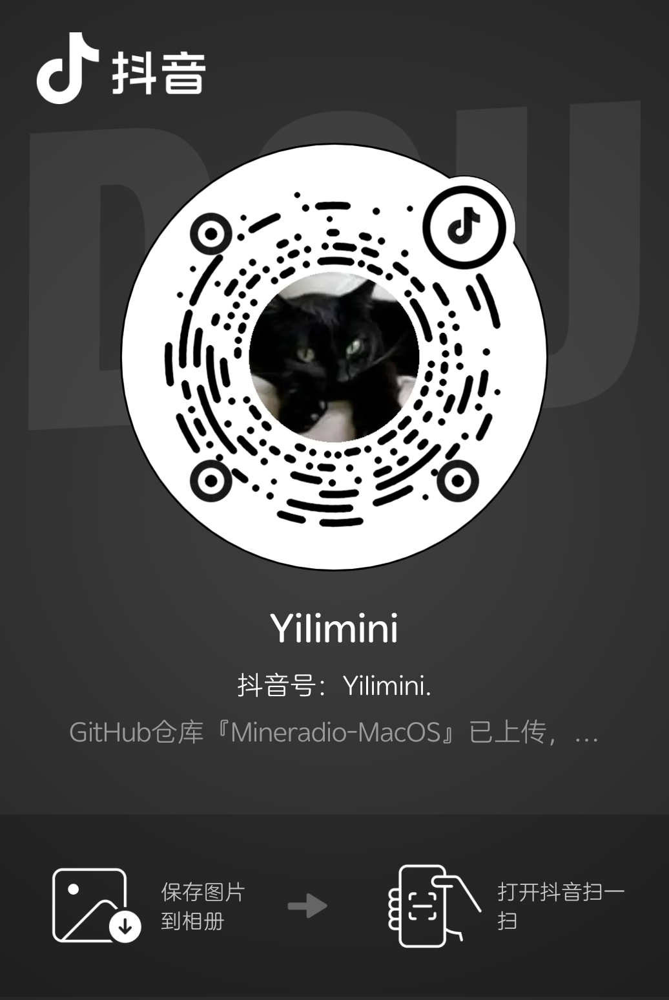

# MineradioMacOS

沉浸式桌面音乐播放器，将天气电台、搜索播放、歌词舞台、粒子视觉和 3D 歌单架组合成一个更接近现场感的私人音乐空间。

## 关于

**Mine** + **Radio**。

Mine 取自"我的"，也暗合 Mining（挖掘）——从海量音乐中挖掘属于你的声音。Radio 是电台，也是无线电波——那些随天气、心情和时间流动的不可预测的共鸣。

Mineradio 不只是一个播放器。它把音乐变成可以看见的东西——粒子随节拍起伏，歌词在 3D 舞台上浮现，专辑封面像黑胶唱片一样旋转。打开天气电台，让窗外的雨声和室内的旋律一起编排。

> 原作 Windows 版由 XxHuberrr 设计开发。本仓库为 macOS 移植与维护版本。

## 当前版本

`1.4.0` — Three.js r160 + GPU 深度优化

## 核心特性

- **天气电台** — Open-Meteo 根据位置/城市/天气 mood 生成播放队列
- **多源搜索** — 网易云 + QQ音乐 + Bilibili + Kugou + LX 音源
- **粒子可视化** — 5 种预设 (SILK/TUNNEL/ORBIT/VOID/WALLPAPER) + 骷髅 + 炫酷三模式（柱形/泡沫/不规则）
- **3D 歌单架** — 双模式卡片堆叠 (side/stage)，PSP 风格交互，无图自动 ❤️ 占位
- **舞台歌词** — 多行 3D plane 渲染，阶梯层次，跟随鼠标视角旋转
- **桌面浮层** — 歌词浮窗 + 壁纸模式，支持全局中键穿透，全屏自动暂停
- **DIY 玩家模式** — 自定义着色器参数、视觉存档导入导出
- **账号体系** — 网易云 + QQ 音乐扫码/Cookie 登录
- **自动更新** — GitHub Releases 检测 + 增量补丁下载
- **手势控制** — 三选一模式：视觉手势（捏合旋转/握拳收束/手掌推开）、手势控歌（拳头播放/食指下一首/手掌暂停），指头识别，阈值可调
- **炫酷配色** — 5 套主题可选（暗夜/水墨/紫金/珊瑚/极光）
- **质量档位** — eco / balanced / high / ultra，一键控制柱体密度、粒子网格、光照复杂度、帧更新频率

## 开发运行

```bash
npm install
npm start                  # 开发运行
npm test                   # 100 项单元测试
npm run build:mac -- --arm64 --x64  # macOS DMG+ZIP 双架构
```

桌面版入口由 Electron 主进程加载本地 HTTP 服务，构建产物位于 `dist/`。

## 安装与上手

### 下载

从 [Releases](https://github.com/YiIimini/Mineradio-MacOS/releases) 下载对应架构的 `.dmg`：
- **Apple Silicon**（M1-M4）：`Mineradio-MacOS-1.4.0-mac-arm64.dmg`
- **Intel**：`Mineradio-MacOS-1.4.0-mac-x64.dmg`

### 安装

打开 `.dmg`，将 MineradioMacOS 拖入 Applications 文件夹。

> **首次打开**：右键（Control+点击）MineradioMacOS → 选择"打开" → 再次点击"打开"。只需一次。

### 快速上手

1. **搜索播放**：顶部搜索栏输入歌名/歌手 → 点击结果播放
2. **导入本地**：点击 📤 按钮导入 MP3/FLAC/WAV/M4A
3. **登录同步**：右上角「登录」→ 网易云/QQ 音乐扫码，同步歌单和红心
4. **视觉切换**：点击右下角 🎚 → 视觉预设 → 9 种效果可选
5. **性能调节**：视觉控制台 → 高级参数 → 画质档位（eco/balanced/high/ultra）
6. **歌词设置**：视觉控制台 → 歌词外观 → 显示行数 / 字体 / 大小

> 📖 完整使用说明见 **[USER_GUIDE_v1.4.0.md](docs/USER_GUIDE_v1.4.0.md)**

## 技术架构

```
Electron 33 + Node.js HTTP Server + Three.js r160 (WebGL 2.0)
├── 后端: raw http.createServer (路由表 46 映射)
├── 前端: 单页 SPA + 多窗口 (桌面歌词/壁纸)
├── 模块: beat-analysis / shelf-3d / login / gesture
├── 安全: CORS localhost / CSP (worker-src blob) / X-Frame-Options
├── GPU: 质量档位 (eco/balanced/high/ultra) / 跳帧 / frustum 剔除 / LOD
└── 测试: 100 项 (utils / weather / dj-analyzer)
```

## 平台

仅支持 macOS（Apple Silicon + Intel），主要功能依赖 Swift 原生辅助程序和 Metal 渲染。

## 更新机制

应用启动 9 秒后自动检测 GitHub Releases 新版本，标题栏更新按钮亮起提示。点击「立即更新」自动下载 DMG，支持进度显示、国内镜像加速和断点续传。下载完成后手动打开安装。不会静默安装。

## v1.4.0 更新日志

### 🚀 Three.js r128 → r160 (WebGL 2.0)
- 纹理系统适配：CanvasTexture 替换 plain Texture，`source.data` 更新
- InstancedMesh 适配：`BufferAttribute` → `InstancedBufferAttribute`
- 色域锁定：`outputColorSpace = LinearSRGBColorSpace` 保持视觉效果一致
- Shader 自动转换：Three.js 内置 WebGL 1→2 GLSL 转换
- 脚本加载顺序修复：shelf-3d/beat-analysis 事件监听器延迟初始化

### 🔥 GPU 深度优化
- **Tier 1 即时见效**：柱体颜色 GC 消除（~12,544 对象/帧）、frustum 剔除全开、泡沫网格 224→128、Chromium GPU flags 精简
- **Tier 2 显著改善**：柱体权重预计算（JS 循环简化为乘加）、粒子 bloom 合并为单通道、壁纸全屏智能暂停
- **Tier 3 架构改进**：质量档位全链路（柱体密度 3,136-12,544、粒子网格 88-183²、光照降级）、跳帧更新、边缘柱体透明
- **预期 GPU 降幅**：eco 模式 65-80%，balanced 40-55%

### 🎮 手势控歌
- 三选一模式：关闭 / 手势触碰（视觉） / 手势控歌（播放），互不干扰
- 指头识别：✊ 拳头→播放、☝ 食指→下一首、✋ 手掌→暂停
- 可调阈值：拳头/食指/手掌阈值、保持时间、冷却间隔均可在 UI 调整
- Canvas 图片帮助弹窗（Electron 无头渲染）

### 🎤 多行歌词优化
- 周边行独立 3D plane，Z-depth 阶梯层次，左右交错
- 鼠标拖拽旋转时自动跟随相机视角
- 行数设置（0-20）即时生效，参数持久化

### 🎨 炫酷配色系统
- 5 套可切换主题：暗夜（默认蓝红）、水墨（青墨宣纸白）、紫金、珊瑚、极光
- 视觉控制台实时切换，用户选择保留

### 🛠 修复
- 设置参数持久化：`particleLyrics`、`floatLayer`、`lyricSourceMode` 恢复存档
- 切歌递归栈溢出：`finalizeListenSession` 先置 null 再 tick
- `ReadLyricLayout` 启动报错：`presetMeta` 守卫
- 歌单无封面：默认 ❤️ 占位图
- CSP blob Worker：服务端 HTTP 头 `worker-src blob:`
- Electron 内部 `renderer_init` URL 警告抑制

### 📄 文档
- 完整 GPU 优化方案：`docs/GPU_OPTIMIZATION_PLAN.md`

## 社交媒体

本人为 MineradioMacOS 移植与深度优化二创作者，欢迎各位小伙伴关注，后续不定式更新ing...

<div align="center">
  <a href="https://www.douyin.com/user/yiilimini" target="_blank">
    
  </a>
  <br><sub>抖音 · 开发者动态 & 更新预告</sub>
</div>

## 打赏支持

原作 XxHuberrr，本仓库为 macOS 移植与深度优化版本。如果 MineradioMacOS 给你带来了更好的音乐体验，欢迎请维护者喝杯咖啡 ☕

<div align="center">
  <table>
    <tr>
      <td align="center" width="300">
        <br>
        <sub>微信赞赏</sub>
      </td>
      <td align="center" width="300">
        <br>
        <sub>支付宝</sub>
      </td>
    </tr>
  </table>
</div>

## 第三方音乐平台

本项目不是任何音乐平台的官方客户端。第三方平台接入仅用于个人学习、本地体验和自有账号播放辅助。请遵守对应平台的用户协议与版权规则。

## 用户数据与隐私

登录 Cookie、搜索历史、自定义封面、自定义歌词、节奏分析缓存等仅保存在本机。详见 [PRIVACY.md](./PRIVACY.md)。

## 致谢

原作设计与开源分享：XxHuberrr。macOS 移植与维护：YiIimini。早期体验与测试反馈：emily、小天才e宝、应春日、锋将军、軌跡、林中、骊、风痕、花椰菜🥦。

## 版权与授权

GPL-3.0。详见 [LICENSE](./LICENSE)。
